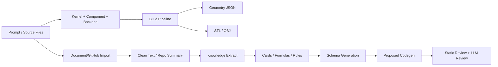

# LabCEM LEAP71 SDF Workbench

LabCEM 是一個可插拔 Kernel 的幾何建模與知識工程平台，保留既有 GUI / CLI / Core 架構，並提供：
- Domain Kernel 建模（acoustic / footwear / mechanical）
- 規則式知識萃取（Rules Agent）
- LLM 知識萃取與程式草案（LLM Agent）
- Hybrid 模式（Rules + LLM）
- Waveguide 幾何輸出（STL / OBJ / JSON）

---

## 1. 專案功能總覽

### 1.1 幾何建模
- 透過 GUI Prompt 或 CLI `run` 建立 component 幾何
- 目前 acoustic kernel 可直接建模 waveguide
- 輸出包含：
  - `outputs/latest_run/waveguide_demo.stl`
  - `outputs/latest_run/waveguide_demo.obj`
  - `outputs/latest_run/design_spec.json`
  - `outputs/latest_run/build_report.json`
  - `outputs/latest_run/validation_report.json`
  - `outputs/latest_run/metadata.json`

### 1.2 知識匯入與萃取
- 支援來源：PDF / DOCX / MD / TXT / JSON / 本地 repo
- 轉換成 `clean_text.json` 或 `repo_summary.json`
- 萃取輸出：Knowledge Cards / Formula Cards / Rules

### 1.3 Schema 與程式草案
- 由知識卡生成 component schema
- 生成 proposed builder / solver / test（僅輸出到 `generated/`）
- 靜態審核 + LLM 審核分離執行

### 1.4 Agent Mode
- `rules`：只用規則式 agent
- `llm`：只用 LLM agent（需啟用 LLM）
- `hybrid`：先 rules 再 llm；若 LLM 不可用會自動降級 rules

---

## 2. 架構與流程



---

## 3. 環境需求

- Python 3.10+
- 建議 Windows PowerShell
- 必要套件：`numpy`, `scipy`, `scikit-image`, `trimesh`, `pyvista`, `matplotlib`

可選套件（非必裝）：
- `pypdf`（讀 PDF）
- `python-docx`（讀 DOCX）
- `openai`（啟用 OpenAI/相容 API）
- `python-dotenv`（自動讀 `.env`）

---

## 4. 快速開始

### 4.1 啟動虛擬環境
```powershell
cd D:\Code\CEM_Test
.\venv\Scripts\Activate.ps1
```

### 4.2 啟動 GUI
```powershell
.\Run-LabCEM-GUI.bat
```

### 4.3 CLI 快速建模
```powershell
python -m labcem.cli run --spec "create waveguide throat 25 mouth 180x120 depth 90" --kernel acoustic_kernel --backend python_sdf --output outputs/generated_geometry.json
```

---

## 5. GUI 操作步驟（完整流程）

### Step 0：建模前設定
1. Domain Kernel：選 `acoustic_kernel`
2. Component：選 `waveguide`
3. Backend：建議先用 `python_sdf`
4. Agent Mode：選 `rules` / `llm` / `hybrid`

### Step 1：知識來源匯入
1. 按「新增檔案」或「新增資料夾/GitHub Repo」
2. 按「匯入知識來源」
3. 產生 `knowledge/sources/*.clean_text.json` 或 `*.repo_summary.json`

### Step 2：擷取知識卡
1. 按「擷取知識卡」
2. 產生：
   - `knowledge/cards/*.json`
   - `knowledge/formulas/*.json`
   - `knowledge/rules/*.json`

### Step 3：生成 Schema / 程式草案
1. 按「生成 Schema」
2. 按「生成程式草案」
3. 產生：
   - `schemas/<component>_schema.json`（rules）
   - `schemas/<component>_schema.llm.json`（llm）
   - `generated/proposed_components/*.py`
   - `generated/proposed_solvers/*.py`
   - `generated/proposed_tests/*.py`

### Step 4：審核草案
1. 按「審核草案」
2. 產生：
   - `generated/review_reports/*_review_report.json`（static）
   - `generated/review_reports/*_llm_review_report.json`（llm）

### Step 5：幾何建模輸出
1. 在 Prompt 輸入需求
2. 按「執行計算」
3. 於 3D Preview + log 查看結果

---

## 6. CLI 指令手冊

### 6.1 建模
```powershell
python -m labcem.cli run --spec "create waveguide throat 25 mouth 180x120 depth 90" --kernel acoustic_kernel --backend python_sdf --output outputs/generated_geometry.json
```

### 6.2 匯入來源
```powershell
python -m labcem.cli ingest add --kernel acoustic_kernel --source docs\waveguide_design.md
python -m labcem.cli ingest add --kernel acoustic_kernel --source docs\a.pdf --source docs\b.docx
```

### 6.3 擷取知識
```powershell
python -m labcem.cli ingest extract --kernel acoustic_kernel --source-id waveguide_design --component waveguide --agent-mode rules
python -m labcem.cli ingest extract --kernel acoustic_kernel --source-id waveguide_design --component waveguide --agent-mode llm
python -m labcem.cli ingest extract --kernel acoustic_kernel --source-id waveguide_design --component waveguide --agent-mode hybrid
```

### 6.4 生成 Schema
```powershell
python -m labcem.cli kernel schema --kernel acoustic_kernel --component waveguide --agent-mode rules
python -m labcem.cli kernel schema --kernel acoustic_kernel --component waveguide --agent-mode llm
```

### 6.5 生成程式草案
```powershell
python -m labcem.cli agent propose-code --kernel acoustic_kernel --component waveguide --agent-mode llm
```

### 6.6 草案審核
```powershell
python -m labcem.cli agent review --kernel acoustic_kernel --component waveguide --agent-mode llm
```

### 6.7 LLM 狀態
```powershell
python -m labcem.cli agent llm-status
```

---

## 7. Label9 / LLM 設定

### 7.1 `.env` 設定方式
專案根目錄可放 `.env`（若安裝 `python-dotenv` 會自動讀取）。

範例（見 `.env.example`）：
```env
LABCEM_LLM_ENABLED=false
LABCEM_LLM_PROVIDER=openai
LABCEM_LLM_MODEL=gpt-5.5-thinking
LABCEM_LLM_API_KEY=
LABCEM_LLM_BASE_URL=
```

### 7.2 使用 Label9（OpenAI-compatible）
若 Label9 提供 OpenAI-compatible API：
```env
LABCEM_LLM_ENABLED=true
LABCEM_LLM_PROVIDER=local_openai_compatible
LABCEM_LLM_MODEL=<Label9提供的模型名稱>
LABCEM_LLM_API_KEY=<Label9 token或key>
LABCEM_LLM_BASE_URL=http://127.0.0.1:<port>/v1
```

> 注意：
- 未啟用或缺少 API key 時，GUI/CLI 不會 crash，會回退 rules 或提示未啟用。
- 系統不會把 API key 寫進 log、json、report。

---

## 8. 如何套用知識卡

1. 準備資料來源（PDF/MD/DOCX/TXT/JSON/repo）
2. `ingest add` 轉成 clean text / repo summary
3. `ingest extract` 產生 knowledge cards
4. `kernel schema` 讓知識卡轉成 schema
5. `agent propose-code` 產生 proposed builder/solver/test
6. `agent review` 完成靜態規則檢查與 LLM review
7. 人工審核後才可手動合併到正式 component

原則：
- 低信心公式僅能作為 `implementation_hints`
- proposed code 不可直接覆蓋正式 component
- LLM review 不可取代 static review

---

## 9. 主要輸出檔案位置

### 9.1 建模輸出
- `D:\Code\CEM_Test\outputs\generated_geometry.json`
- `D:\Code\CEM_Test\outputs\latest_run\*.stl`
- `D:\Code\CEM_Test\outputs\latest_run\*.obj`
- `D:\Code\CEM_Test\outputs\latest_run\*.json`

### 9.2 知識工程輸出（以 acoustic kernel 為例）
- `D:\Code\CEM_Test\src\labcem\kernels\acoustic_kernel\knowledge\sources\`
- `D:\Code\CEM_Test\src\labcem\kernels\acoustic_kernel\knowledge\cards\`
- `D:\Code\CEM_Test\src\labcem\kernels\acoustic_kernel\knowledge\formulas\`
- `D:\Code\CEM_Test\src\labcem\kernels\acoustic_kernel\knowledge\rules\`
- `D:\Code\CEM_Test\src\labcem\kernels\acoustic_kernel\schemas\`
- `D:\Code\CEM_Test\src\labcem\kernels\acoustic_kernel\generated\proposed_components\`
- `D:\Code\CEM_Test\src\labcem\kernels\acoustic_kernel\generated\proposed_solvers\`
- `D:\Code\CEM_Test\src\labcem\kernels\acoustic_kernel\generated\proposed_tests\`
- `D:\Code\CEM_Test\src\labcem\kernels\acoustic_kernel\generated\review_reports\`

---

## 10. 安全限制（必讀）

- LLM 不可直接修改 `labcem/core`
- LLM 不可直接修改 GUI/CLI（除非人工允許）
- LLM 不可直接覆蓋正式 `components/*.py`
- LLM 輸出僅允許寫入 `generated/proposed_*`
- build() 必須透過 backend（不可直接 `mesh.export()`）
- LLM 不可直接輸出 STL/OBJ
- static review 必跑；LLM review 只做補充

---

## 11. 常見問題排除

### Q1: GUI 顯示 `LLM Disabled`？
- 檢查 `.env` 或系統環境變數：
  - `LABCEM_LLM_ENABLED=true`
  - `LABCEM_LLM_API_KEY` 有值
- 按 GUI「檢查 LLM 狀態」確認

### Q2: PDF/DOCX 匯入失敗？
- 安裝可選套件：
```powershell
pip install pypdf python-docx
```

### Q3: 選 `llm` 但仍顯示規則式？
- LLM 不可用時，系統會保護性 fallback 或提示錯誤，不會 crash。
- 請檢查 `BASE_URL`、API key、模型名稱是否正確。

### Q4: `mesh_sdf` / `picogk` 後端錯誤？
- 先用 `python_sdf` 驗證流程。
- 部分後端若未安裝依賴會退化或不可用。

---

## 12. 建議驗收指令

```powershell
cd D:\Code\CEM_Test
.\venv\Scripts\Activate.ps1

python -m labcem.cli run --spec "create waveguide throat 25 mouth 180x120 depth 90" --kernel acoustic_kernel --backend python_sdf --output outputs/generated_geometry.json

python -m labcem.cli agent llm-status

python -m labcem.cli ingest add --kernel acoustic_kernel --source docs\waveguide_design.md
python -m labcem.cli ingest extract --kernel acoustic_kernel --source-id waveguide_design --component waveguide --agent-mode hybrid
python -m labcem.cli kernel schema --kernel acoustic_kernel --component waveguide --agent-mode hybrid
python -m labcem.cli agent propose-code --kernel acoustic_kernel --component waveguide --agent-mode hybrid
python -m labcem.cli agent review --kernel acoustic_kernel --component waveguide --agent-mode hybrid
```

---

## 13. 授權與注意事項

- 本專案含多種可選依賴與外部工具整合。
- 建議以 `python_sdf + rules/hybrid` 先完成主流程，再逐步啟用 LLM/Label9。
- 任何 generated proposal 進正式核心前，請務必經人工審核與測試。
